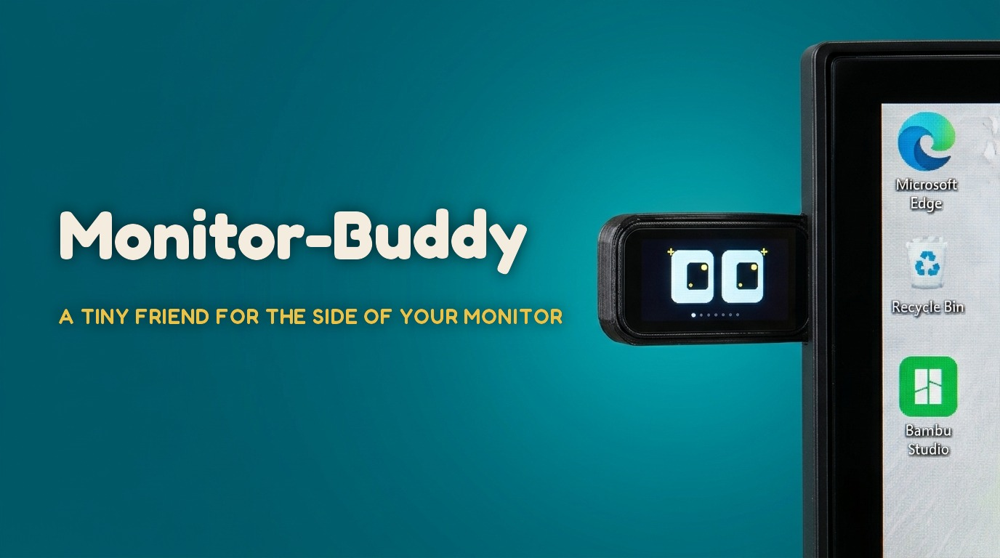
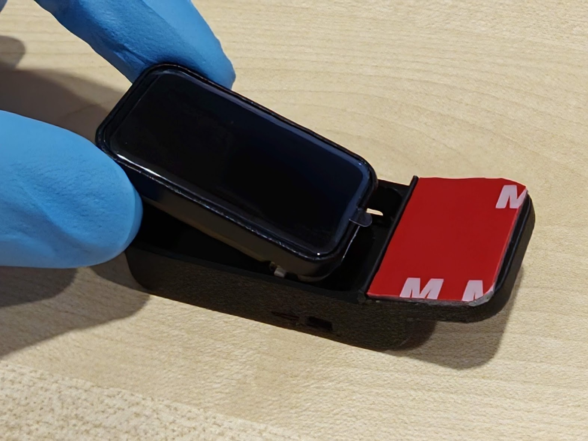
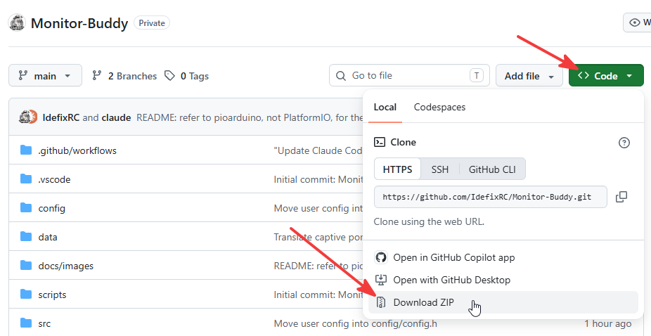
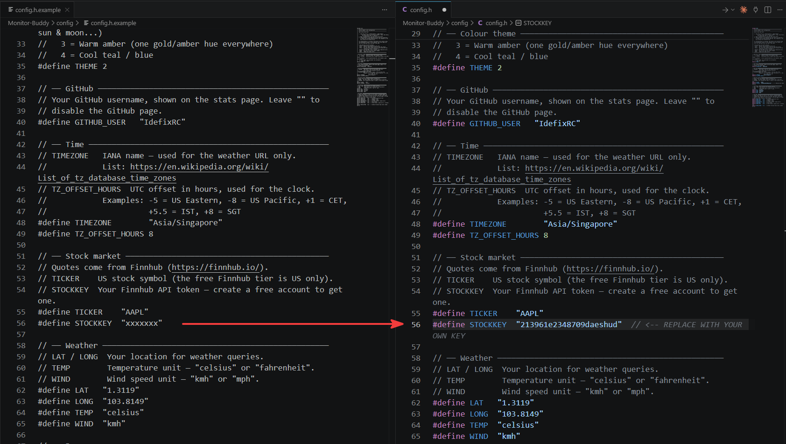
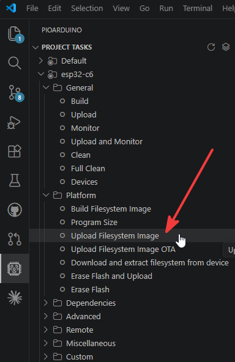
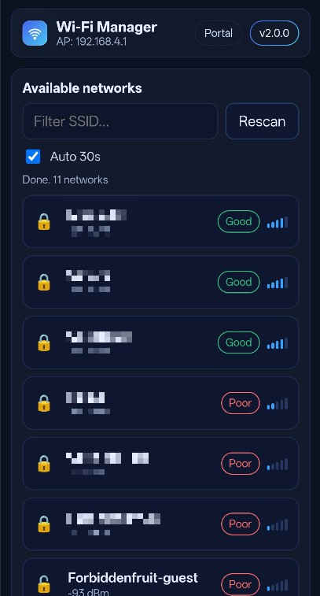

# Monitor-Buddy

**A tiny friend for the side of your monitor.** It pulls faces at you, follows your movements with its eyes, and in its spare time tells you the weather, the date, the moon phase, your stock ticker, and your GitHub stats.

<!-- SHOT: hero.jpg - Monitor-Buddy clipped to the right edge of a monitor, screen showing the animated face, taken slightly from the side so you can see the printed holder -->



---

## 1. Meet Monitor-Buddy

Your monitor has a bezel. That bezel is doing nothing. Monitor-Buddy fixes that.

It is a small touchscreen that clips onto the edge of your screen and keeps you company while you work. Most of the time it just shows a face: it blinks, it glances around, and when you pick it up or tilt it, its eyes roll with the motion. Poke the face and it changes expression. It is pointless and you will love it.

It is also genuinely useful when you swipe past the face:

- **Animated face** with several expressions, driven by the on-board QMI8658 motion sensor
- **Clock** and **weekday / date**, kept accurate over NTP
- **Weather** for your location (temperature, conditions, humidity, wind)
- **Moon phase** with illumination percentage
- **Stock ticker** for any US symbol, via a free Finnhub account
- **GitHub stats** for your username
- **5 colour themes**, from plain white-on-black to a green-up / red-down semantic theme
- **Toggle any page on or off** so your Buddy only shows what you care about
- **Swipe** left and right to move between pages, **double-tap** to stop the auto-scroll, **tap the face** to change expression
- **Wi-Fi setup with no code**: Monitor-Buddy runs its own hotspot with a captive portal. Join it from your phone, pick your network, done.

The whole thing is a **cheap Waveshare ESP32-C6 touchscreen** and **one 3D-printed clip**. **No soldering**, no breadboard, and no wiring required. You print the holder, slide the board in, and plug in a USB-C cable and Monitor-Buddy is ready to rock.

---

## 2. What you need

| Item                                                                                    | Quantity | Where                                                                                                                  |
| --------------------------------------------------------------------------------------- | -------- | ---------------------------------------------------------------------------------------------------------------------- |
| 3D-printed holder: `Monitor Side Mount_flat.STL` **or** `Monitor Side Mount_cutout.STL` | 1        | [MakerWorld](https://makerworld.com/en/models/3096322-digi-hami-your-digital-desk-hamster-companion#profileId-3489563) |
| Waveshare ESP32-C6-Touch-LCD-1.47                                                       | 1        | [AliExpress](https://s.click.aliexpress.com/e/_c33mPWKx)                                                               |
| USB-C cable (power and flashing)                                                        | 1        | [AliExpress](https://www.aliexpress.com/item/1005008819293735.html)                                                    |

You also need a computer to flash the board once. After that the USB-C cable is only for power, so any charger or a spare USB port on the monitor will do.

> **Note:** the MakerWorld link is a placeholder until the print files are published. It currently points at a different model.

Nothing else. No resistors, no headers, no hot glue.

---

## 3. Assembly

<!-- SHOT: holder-versions.jpg - the two printed parts side by side on a desk, labelled flat vs cutout -->


### a) Print the holder

There are two versions of the mount. Pick one:

- **`Monitor Side Mount_flat.STL`** has a flat back. Stick it to the side of your monitor with a strip of ordinary double-sided tape.
- **`Monitor Side Mount_cutout.STL`** has a recess sized for **3M Dual Lock** tape. Use this one if you want to be able to pull the Buddy off and put it back without peeling anything.

PLA or PETG is recommended. Only minor supports needed.

### b) Slide the board into the holder

<!-- SHOT: assembly-slide-in.jpg - hand sliding the Waveshare board into the printed holder, USB-C port facing down/out -->



The Waveshare board slides straight into the printed part and is held by friction. No glue, no screws.

### c) Flash the board

Follow [chapter 4](#4-flashing-the-board) below. You only do this once.

### d) Apply power and enjoy your new monitor friend

Plug in the USB-C cable. The first time it boots with no Wi-Fi configured, it opens its setup hotspot (see [4.9](#49-first-boot-connect-it-to-wi-fi)).

If you print one, **post a picture of your build on MakerWorld**, and if the model saved you some time, a like or a boost is appreciated. 🙏

---

## 4. Flashing the board

This guide assumes you have never used VS Code or PlatformIO. It is written for **Windows**, with notes for **macOS** and **Linux** where they differ. It takes about 20 minutes the first time, most of which is software downloading in the background.

The board is a **Waveshare ESP32-C6-Touch-LCD-1.47**. The ESP32-C6 is new enough that it needs the **pioarduino** build platform, a community fork of the standard ESP32 tooling. The steps below install everything.

### 4.1 Install VS Code

<!-- SHOT: vscode-install.png - code.visualstudio.com download page with the Windows button highlighted -->


1. Go to <https://code.visualstudio.com/>.
2. Download the build for your OS and run the installer.
3. On Windows, accept the defaults. Ticking "Add to PATH" is helpful but not required.

Launch VS Code when it finishes.

### 4.2 Install the pioarduino IDE extension

<!-- SHOT: pioarduino-ext.png - VS Code Extensions panel, search box showing "pioarduino", the pioarduino IDE extension result highlighted with its Install button -->


1. Click the **Extensions** icon in the left sidebar (the four-squares icon), or press `Ctrl+Shift+X`.
2. Search for **`pioarduino`**.
3. Install the **pioarduino IDE** extension.
4. Wait for it to finish setting up. It downloads a Python environment and its core tooling in the background, which can take a few minutes. A "PlatformIO" bar appears along the bottom of the window when it is ready.

> **Already have the official PlatformIO extension?** It also works with this project, because the pioarduino platform is pulled in by URL from `platformio.ini`. If you are starting fresh, use the pioarduino extension. It tracks new Espressif chips more closely.

> **macOS / Linux:** identical. The extension installs its own Python environment, so you do not need to install Python yourself.

### 4.3 Get the Monitor-Buddy code

**Option A, download a ZIP (simplest):**

<!-- SHOT: github-download-zip.png - GitHub repo page, green "Code" button open, "Download ZIP" highlighted -->



1. On the GitHub page for this project, click the green **Code** button, then **Download ZIP**.
2. Extract it somewhere permanent, for example `Documents\Monitor-Buddy`. Do not run it from inside the ZIP or from your Downloads folder.

**Option B, clone with Git (if you have it):**

```
git clone https://github.com/IdefixRC/Monitor-Buddy.git
```

### 4.4 Open the project

1. In VS Code: **File > Open Folder**, and select the `Monitor-Buddy` folder (the one that contains `platformio.ini`).
2. If VS Code asks whether you trust the authors, say yes.
3. The first time you open it, PlatformIO reads `platformio.ini` and downloads the pioarduino platform, the ESP32-C6 toolchain, and the libraries this project uses (`Arduino_GFX`, `ArduinoJson`, `AyresWiFiManager`). This is a large download, several hundred MB, and only happens once.

<!-- SHOT: pio-first-build.png - VS Code with the PlatformIO terminal open, showing platform/toolchain/library download progress on first open -->


Wait until the terminal activity stops before moving on.

### 4.5 Personalize your Buddy

One file to touch: `config/config.h`. It is plain text, edit it right inside VS Code.

**a) Create your config file**

1. In the VS Code file explorer, open the `config` folder and find `config.h.example`.
2. Right-click it, **Copy**, then **Paste** into the same `config` folder. Rename the copy to `config.h`.
3. `config/config.h` is gitignored on purpose — it holds your Finnhub API key, so it never gets committed. `config.h.example` is the only config file tracked by git.

<!-- SHOT: config-file.png - VS Code explorer showing config/config.h.example and config/config.h side by side, config.h open with the settings visible -->



**b) Edit your settings**

Open `config/config.h` and change these `#define` lines:

| Setting                        | What to put                                                                                                                   |
| ------------------------------ | ----------------------------------------------------------------------------------------------------------------------------- |
| `THEME`                        | `0` to `4`, see the comments above the line                                                                                   |
| `GITHUB_USER`                  | your GitHub username                                                                                                          |
| `TIMEZONE`                     | your IANA timezone name, for example `"Europe/Berlin"` ([list](https://en.wikipedia.org/wiki/List_of_tz_database_time_zones)) |
| `TZ_OFFSET_HOURS`              | your offset from UTC in hours, for example `1` for CET, `-5` for US Eastern                                                   |
| `TICKER`                       | a US stock symbol, for example `"AAPL"`                                                                                       |
| `STOCKKEY`                     | your free Finnhub API key from <https://finnhub.io/> — replace `xxxxxxx`                                                      |
| `LAT` / `LONG`                 | your latitude and longitude for weather                                                                                       |
| `TEMP` / `WIND`                | `"celsius"` or `"fahrenheit"`, `"kmh"` or `"mph"`                                                                             |
| `SHOW_FACE`, `SHOW_CLOCK`, ... | `true` or `false` to enable or disable each page                                                                              |

<!-- SHOT: config-defines.png - config/config.h open in VS Code, the #define block (THEME, GITHUB_USER, TIMEZONE, TICKER, STOCKKEY, LAT/LONG) visible -->


Save the file (`Ctrl+S`).

Don't care about stocks? Leave `STOCKKEY` as is — the project still builds, the stock page just will not load data, and you can turn it off with `SHOW_STOCK false`. If you skip creating `config/config.h` entirely, the build falls back to the defaults in `config.h.example`.

### 4.6 Plug in the board

Connect the Waveshare board to your computer with the USB-C cable.

- **Windows 10 / 11:** the board uses the ESP32-C6's built-in USB, so it usually appears with no driver install. If Device Manager shows an unknown device, install the Espressif USB-JTAG/serial driver from <https://github.com/espressif/esp-usb-jtag>.
- **macOS:** no driver needed. The port shows up as `/dev/cu.usbmodemXXXX`.
- **Linux:** no driver needed. The port is usually `/dev/ttyACM0`. If uploads fail with a permissions error, add yourself to the `dialout` group: `sudo usermod -aG dialout $USER`, then log out and back in.

PlatformIO detects the port automatically. You do not normally need to select it by hand.

### 4.7 Build and upload the firmware

<!-- SHOT: pio-toolbar.png - the PlatformIO status bar at the bottom of VS Code, with the checkmark (Build), right-arrow (Upload), and the "..." leading to Project Tasks annotated -->


Along the bottom bar of VS Code, PlatformIO adds a row of small icons:

1. Click the **checkmark (Build)** first. This compiles the project. The first build takes a few minutes. It ends with `SUCCESS`.
2. Click the **right-arrow (Upload)**. This flashes the firmware onto the board. The screen goes dark for a moment and then the Buddy starts up.

If the upload fails to start, hold the **BOOT** button on the board, click Upload again, and release BOOT once you see it connecting. Do not hold BOOT through a power cycle, that puts the chip into a different download mode.

### 4.8 Upload the portal files

The Wi-Fi setup page lives in the `data/` folder and has to be copied to the board's flash storage separately from the firmware.

<!-- SHOT: pio-project-tasks.png - PlatformIO panel expanded, esp32-c6 > Platform > "Upload Filesystem Image" highlighted -->



1. Open the **PlatformIO** panel from the left sidebar (the alien-head icon).
2. Expand **esp32-c6 > Platform**.
3. Click **Upload Filesystem Image**.

You only have to do this manually once. After that, this project re-uploads the portal files automatically whenever you change something in `data/`, so a normal firmware upload is enough.

> If you skip this step, the Buddy boots but shows **PORTAL FILES MISSING** on screen, and the setup page returns an error.

### 4.9 First boot: connect it to Wi-Fi

<!-- SHOT: portal-phone.jpg - a phone showing the Monitor-Buddy captive portal with a list of Wi-Fi networks -->



With no Wi-Fi configured, the Buddy starts its own hotspot at power-on.

1. On your phone or laptop, join the Wi-Fi network **`Monitor-Buddy-Setup`**, password **`buddy1234`**.
2. A setup page should open by itself. If it does not, open a browser and go to **`http://192.168.4.1`**.
3. Pick your home network, enter its password, and save.
4. The Buddy reboots and connects. The clock, weather, and other pages fill in within a few seconds.

To change the Wi-Fi later, **press and hold anywhere on the touchscreen for about 3 seconds**. The setup hotspot comes back.

### 4.10 Troubleshooting

| Symptom                                     | Fix                                                                                                                                                                      |
| ------------------------------------------- | ------------------------------------------------------------------------------------------------------------------------------------------------------------------------ |
| No port shown / Upload can't find the board | Try a different USB-C cable. Many are charge-only. On Windows, check Device Manager for an unknown device and install the driver linked in [4.6](#46-plug-in-the-board). |
| Upload starts then fails                    | Hold **BOOT**, click Upload, release BOOT when it connects.                                                                                                              |
| Screen shows **PORTAL FILES MISSING**       | You skipped [4.8](#48-upload-the-portal-files). Run **Upload Filesystem Image**.                                                                                         |
| Setup page shows an error 500               | Same cause. Upload the filesystem image.                                                                                                                                 |
| Clock or weather never updates              | Wi-Fi did not connect. Hold the screen for 3 seconds and redo the setup. Check `TZ_OFFSET_HOURS`.                                                                        |
| Stock page is blank                         | Missing or wrong Finnhub key in `config/config.h`, or the symbol is not a US stock (the free Finnhub tier is US only).                                                     |
| Build fails mentioning `ArduinoJson`        | Deprecation _warnings_ from `ArduinoJson` are expected and harmless. Only a red `error` is a real problem.                                                               |

---

## Acknowledgements

Monitor-Buddy builds on the work of others:

- **[schematik.io](https://schematik.io/)** Tiny ESP DeskBuddy, the starting-point idea.
- **[EDISON-SCIENCE-CORNER / DESKBUDDY-1.0](https://github.com/EDISON-SCIENCE-CORNER/DESKBUDDY-1.0)** for additional face designs.
- **[AyresWiFiManager](https://github.com/ayresnet/AyresWiFiManager)** for the captive-portal Wi-Fi setup.

## License

MIT. See [LICENSE](LICENSE).
